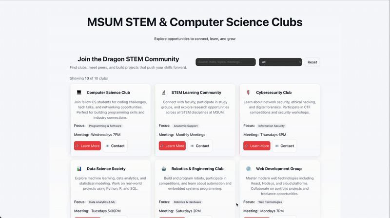

# WEB102 Prework - MSUM Dragons — STEM & Computer Science Clubs

Submitted by: **Natoli Tesgera**

Time spent: **3** hours

MSUM Dragons is a single-page React + Vite application that showcases STEM and Computer Science student clubs at Minnesota State University Moorhead. The app is a lightweight directory designed to help students discover clubs, search and filter by focus area, view club details, and contact organizers.

---

## Required Features

The following **required** functionality is completed:

* [x] A prominent introduction / hero explaining the purpose of the site.
* [x] A responsive card grid that displays clubs with a visual accent for each club.
* [x] Live search to find clubs by name, description, or focus.
* [x] Focus filter (select) to show only clubs that match a focus category.
* [x] A details modal (accessible) that shows more information about a club.
* [x] Contact links (mailto:) for quick outreach to club organizers.

## Optional Features

The following **optional** features are implemented or partially implemented:

* [x] Keyboard focus styles and accessible attributes for cards and modal.
* [x] Responsive layout: grid collapses to 1/2/3 columns depending on viewport.
* [x] Polished visual design: gradients, consistent buttons, and modern spacing.

---

## Video Walkthrough

Here's a walkthrough of implemented features:

GIF created with [Ezgif](https://ezgif.com/) 

---

## Project structure

- public/ — static assets served by Vite
- src/
  - App.jsx — main application shell (hero, search/filter, grid, modal)
  - App.css — application styles (layout, card styles, modal)
  - index.css — global resets and small utilities
  - main.jsx — app entry
  - assets/ — images and GIFs used in the README/demo
  - components/
    - ClubCard.jsx — club card component (UI + interactions)
    - Header.jsx — simple header

---

## Setup / Run

1. Install dependencies

   npm install

2. Start dev server

   npm run dev

3. Open the app in the browser at the URL printed by Vite (usually http://localhost:5173)

---

## Notes / Development

- Styles are implemented with plain CSS in `src/App.css` and `src/index.css` (no external CSS framework).
- Club data is currently defined in `App.jsx`. For a larger dataset, move this to a JSON file or an API endpoint and lazy-load/paginate.
- Cards are responsive and use a vertical flex layout to avoid content overlap; the details and action buttons are anchored to the bottom of each card for consistent alignment.

### Possible next steps

- Persist search and filter state in the URL so results are shareable.
- Add unit tests with Jest + React Testing Library.
- Replace inline emoji icons with SVGs or uploaded images for better branding.
- Add animations or micro-interactions for hover/focus states.

---

## License

This project includes a LICENSE file in the repository. See `LICENSE` for license details.

---

